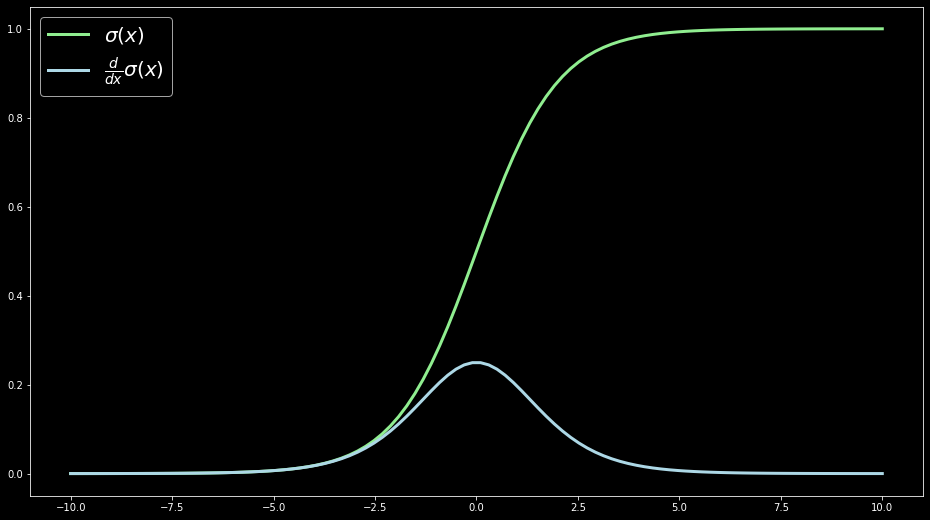

# Implement Sigmoid In Numpy {.unnumbered}

Question: Easy - [3. Implement Sigmoid In Numpy](https://www.tensortonic.com/problems/sigmoid-numpy)

## Background

The sigmoid function is one of the simplest and most widely used activation functions in machine learning. It takes any real number and **maps it smoothly into the range (0, 1)**.

$$ \sigma(x) = \frac{1}{1 + e^{-x}} $$

- If $x$ is very large, then $e^{-x}$ becomes tiny, so the output is approximately $1$.  
- If $x$ is very negative, then $e^{-x}$ becomes huge, so the output is approximately $0$.  
- If $x = 0$, then $e^{-0} = 1$, so the output equals $0.5$.



--- 

::: callout-tip
###### Questions
1. Why use a function like sigmiod?
2. What is the funciton activating?
:::

This is important because many machine learning tasks **deal with probabilities or binary outcomes**.

By mapping raw model outputs (which can be any number) into this range, sigmoid gives results that are:

- Easy to interpret
- Numerically stable
- Probabilistically meaningful

Also, sigmoid is a **smooth, continuous curve** that doesn’t jump suddenly between 0 and 1 like a step function. This matters because in machine learning, especially in neural networks, because gradients are used to adjust weights. Sigmoid is differentiable 

The derivative of the sigmoid function (how fast it changes) allows gradient-based learning like backpropagation to work properly.

Sigmoids introduce **non-linearity**, which lets models capture complex patterns instead of just drawing straight lines.

**What is it activating?**

It takes the neuron’s input (a raw weighted sum) and activates it by converting it into a value between 0 and 1

This “activation” is like saying:  

- If the neuron's input is strongly positive, the neuron fires (close to $1$).  
- If it's strongly negative, the neuron stays quiet (close to $0$).  
- If it's uncertain, the neuron is partially active (around $0.5$).  

## Approach 

Given the function formula: 

$$ \sigma(x) = \frac{1}{1 + e^{-x}} $$

We can simply write a python function for sigmoid as:
```py
import np as numpy
def sigmoid(x):
    return (1 / (1 + np.exp(-x)))
```

Note that the question requires us to return a NumPy array of floats. However, our input can be scalars, Python lists, and NumPy arrays. We solve this by wrapping input with `np.asarray`

```py
import numpy as np

def sigmoid(x):
    """
    Vectorized sigmoid function.
    """
    x = np.asarray(x, dtype=float)
    return (1 / (1 + np.exp(-x)))
```


## Solution
```py
import numpy as np

def sigmoid(x):
    """
    Vectorized sigmoid function.
    """
    x = np.asarray(x, dtype=float)
    return (1 / (1 + np.exp(-x)))
```


